# MasterMind Final Practice

* **Author**: Javier Prieto Cepeda - javier.prieto.cepeda@alumnos.upm.es
* **Version**: Mastermind game implementation with Standalone and Client/Server versions.

# Structure

The structure of this repository is:

* **docs**: This folder has the UML diagrams sources (iuml) and images (png).
* **src**: This folder has the mastermind code (Java language).
* **pom.xml**: This file has the maven project configuration.
* **mastermind_javierprietocepeda.jar**: Mastermind runnable jar file.

# Requisites

* Wiki - Youtube: https://www.youtube.com/watch?v=2-hTeg2M6GQ
* Functionality: Basic + undo/redo
* Interface: Text
* Distribution: Standalone + Client/Server
* Persistence: No

# Project Design

## Arquitecture

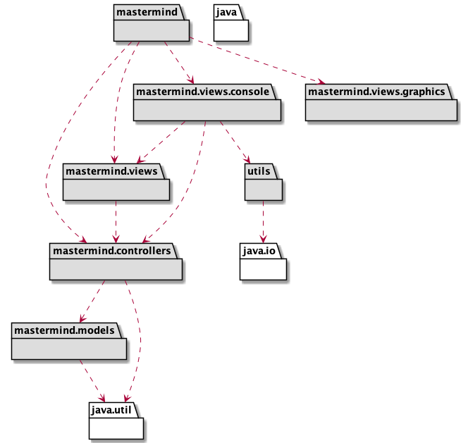

## Packages

### mastermind

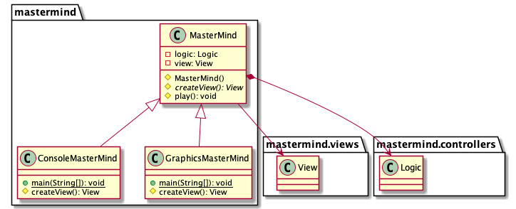

### mastermind.views

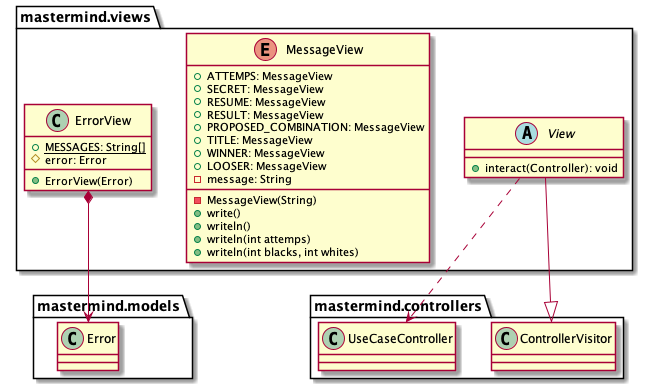

### mastermind.controllers

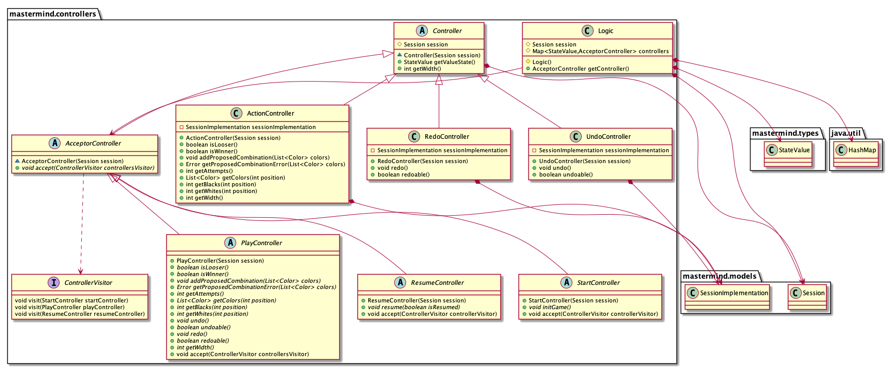

### mastermind.controllers.implementation

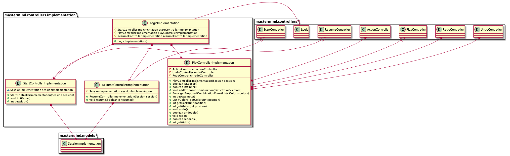

### mastermind.controllers.distributed

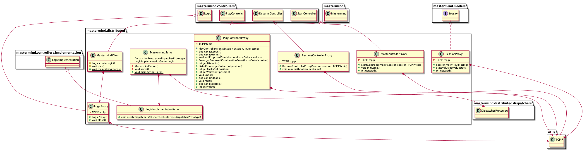

### mastermind.controllers.distributed.dispatchers

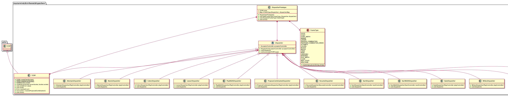

### mastermind.controllers.distributed.dispatchers.undoredo

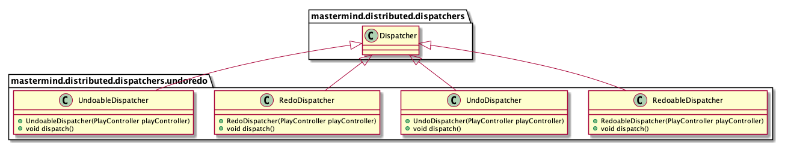

### mastermind.models

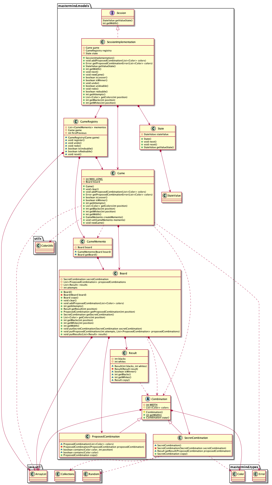

### mastermind.types

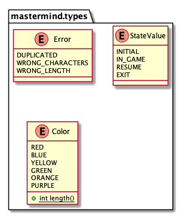

### mastermind.utils

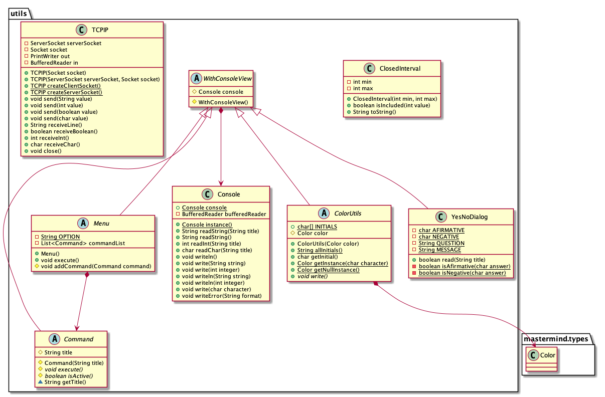

