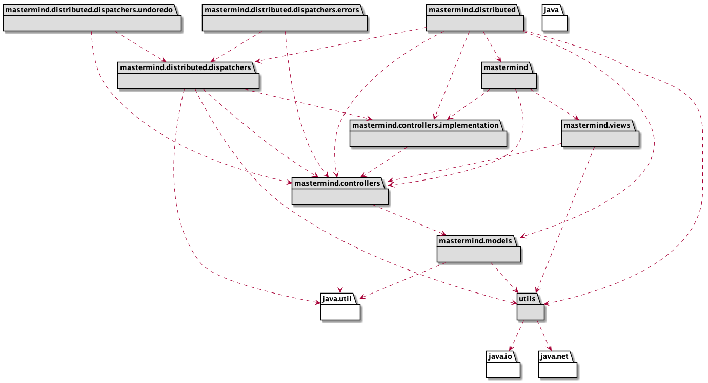
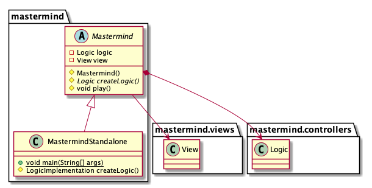
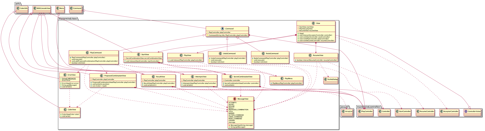
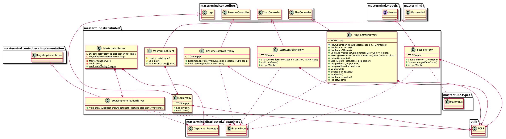
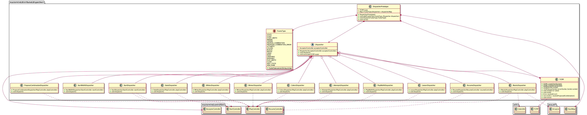
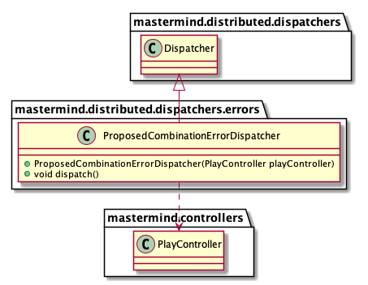
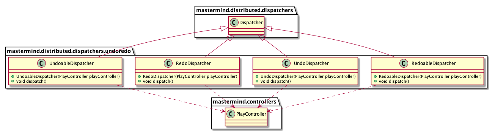
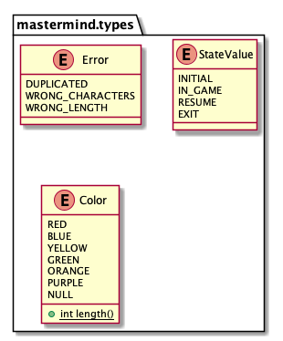
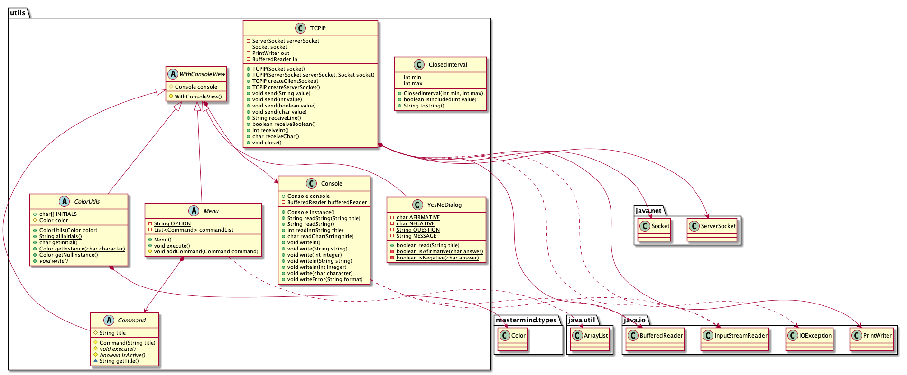

# MasterMind Final Practice

* **Author**: Javier Prieto Cepeda - javier.prieto.cepeda@alumnos.upm.es
* **Version**: Mastermind game implementation with Standalone and Client/Server versions.

# Structure

The structure of this repository is:

* **docs**: This folder has the UML diagrams sources (iuml) and images (png).
* **src**: This folder has the mastermind code (Java language).
* **pom.xml**: This file has the maven project configuration.
* **bin**: Mastermind runnable jar files.

# Requisites

* **Wiki** - Youtube: https://www.youtube.com/watch?v=2-hTeg2M6GQ
* **Functionality**: Basic + undo/redo
* **Interface**: Text
* **Distribution**: Standalone + Client/Server
* **Persistence**: No

# Project Design

## Arquitecture

## Packages

### mastermind

### mastermind.views

### mastermind.controllers

### mastermind.controllers.implementation

### mastermind.controllers.distributed

### mastermind.controllers.distributed.dispatchers

### mastermind.controllers.distributed.dispatchers.errors

### mastermind.controllers.distributed.dispatchers.undoredo

### mastermind.models

### mastermind.types

### mastermind.utils

## Design patterns implemented

To implement the undo/redo + client/server versions, the design patterns implemented are:

* **State**: Implemented to allow the alteration of the game behavior (through controllers) when the state of the game changes.
* **Memento**: Implemented to store game snapshots and to be able to execute undo/redo actions.
* **Command**: Implemented to add multiple actions to the game menu and also to add multiple dispatchers to distributed version.
* **Proxy**: Implemented to be able to use the Standalone and Client/Server versions, making the controllers (mastermind.controllers) abstract.
* **Prototype**: implemented for the creation of the dispatcher objects, associating them to the command type (mastermind.distributed.dispatchers). 

